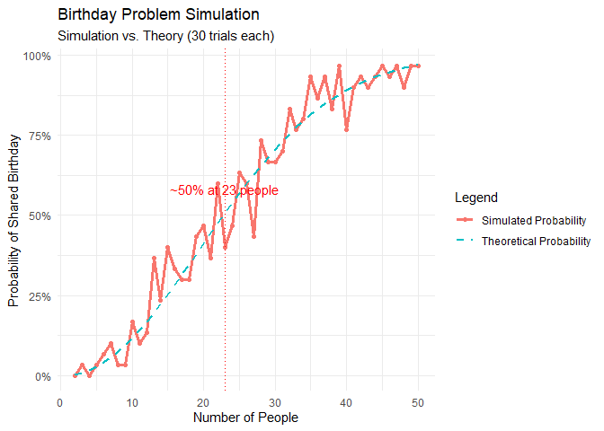

# What is the Birthday Problem?

The Birthday Problem is a famous problem in probability theory that asks
how likely it is that in a group of people, at least two will share the
same birthday. The problem is counterintuitive because it suggests that
a relatively small group of people can have a high probability of
sharing a birthday.

### The question is: How many people do you need in a room for there to be a better than even chance that at least two people share a birthday?

``` r
set.seed(42) # Set seed for reproducibility
verbose <- FALSE # Set to TRUE to see simulation details

# Number of simulation trials
# (the bigger, the closer to the theoretical probability)
tries <- 30
```

``` r
results <- data.frame(
  people = integer(),
  probability = numeric()
)
```

``` r
# Function to simulate one group
simulate_group <- function(n_people) {
  birthdays <- sample(1:365, n_people, replace = TRUE)

  if (verbose) {
    cat(
      "Simulating group of", n_people, "people with birthdays:", birthdays, "\n"
    )
  }

  length(unique(birthdays)) < length(birthdays)
}
```

``` r
# Loop for 2 to 50 people
for (n_people in 2:50) {
  same_birthday <- sum(replicate(tries, simulate_group(n_people = n_people)))
  probability <- same_birthday / tries
  results <- rbind(
    results,
    data.frame(people = n_people, probability = probability)
  )

  cat(
    "For", n_people, "people, the simulated probability of shared birthday is",
    round(probability, 4), "\n"
  )
}
```

    ## For 2 people, the simulated probability of shared birthday is 0 
    ## For 3 people, the simulated probability of shared birthday is 0.0333 
    ## For 4 people, the simulated probability of shared birthday is 0 
    ## For 5 people, the simulated probability of shared birthday is 0.0333 
    ## For 6 people, the simulated probability of shared birthday is 0.0667 
    ## For 7 people, the simulated probability of shared birthday is 0.1 
    ## For 8 people, the simulated probability of shared birthday is 0.0333 
    ## For 9 people, the simulated probability of shared birthday is 0.0333 
    ## For 10 people, the simulated probability of shared birthday is 0.1667 
    ## For 11 people, the simulated probability of shared birthday is 0.1 
    ## For 12 people, the simulated probability of shared birthday is 0.1333 
    ## For 13 people, the simulated probability of shared birthday is 0.3667 
    ## For 14 people, the simulated probability of shared birthday is 0.2333 
    ## For 15 people, the simulated probability of shared birthday is 0.4 
    ## For 16 people, the simulated probability of shared birthday is 0.3333 
    ## For 17 people, the simulated probability of shared birthday is 0.3 
    ## For 18 people, the simulated probability of shared birthday is 0.3 
    ## For 19 people, the simulated probability of shared birthday is 0.4333 
    ## For 20 people, the simulated probability of shared birthday is 0.4667 
    ## For 21 people, the simulated probability of shared birthday is 0.3667 
    ## For 22 people, the simulated probability of shared birthday is 0.6 
    ## For 23 people, the simulated probability of shared birthday is 0.4 
    ## For 24 people, the simulated probability of shared birthday is 0.4667 
    ## For 25 people, the simulated probability of shared birthday is 0.6333 
    ## For 26 people, the simulated probability of shared birthday is 0.6 
    ## For 27 people, the simulated probability of shared birthday is 0.4333 
    ## For 28 people, the simulated probability of shared birthday is 0.7333 
    ## For 29 people, the simulated probability of shared birthday is 0.6667 
    ## For 30 people, the simulated probability of shared birthday is 0.6667 
    ## For 31 people, the simulated probability of shared birthday is 0.7 
    ## For 32 people, the simulated probability of shared birthday is 0.8333 
    ## For 33 people, the simulated probability of shared birthday is 0.7667 
    ## For 34 people, the simulated probability of shared birthday is 0.8 
    ## For 35 people, the simulated probability of shared birthday is 0.9333 
    ## For 36 people, the simulated probability of shared birthday is 0.8667 
    ## For 37 people, the simulated probability of shared birthday is 0.9333 
    ## For 38 people, the simulated probability of shared birthday is 0.8333 
    ## For 39 people, the simulated probability of shared birthday is 0.9667 
    ## For 40 people, the simulated probability of shared birthday is 0.7667 
    ## For 41 people, the simulated probability of shared birthday is 0.9 
    ## For 42 people, the simulated probability of shared birthday is 0.9333 
    ## For 43 people, the simulated probability of shared birthday is 0.9 
    ## For 44 people, the simulated probability of shared birthday is 0.9333 
    ## For 45 people, the simulated probability of shared birthday is 0.9667 
    ## For 46 people, the simulated probability of shared birthday is 0.9333 
    ## For 47 people, the simulated probability of shared birthday is 0.9667 
    ## For 48 people, the simulated probability of shared birthday is 0.9 
    ## For 49 people, the simulated probability of shared birthday is 0.9667 
    ## For 50 people, the simulated probability of shared birthday is 0.9667

``` r
# Theorethical probability function
theoretical_probability <- function(n_people) {
  1 - prod((365:(365 - n_people + 1)) / 365)
}
```

``` r
results <- results %>%
  mutate(theoretical_probability = sapply(people, theoretical_probability))
```

``` r
# Plotting the results
ggplot(results, aes(x = people)) +
  geom_line(
    aes(y = probability, color = "Simulated Probability"),
    linewidth = 1.2
  ) +
  geom_point(aes(y = probability, color = "Simulated Probability")) +
  geom_line(
    aes(y = theoretical_probability, color = "Theoretical Probability"),
    linetype = "dashed",
    linewidth = 1
  ) +
  geom_vline(xintercept = 23, linetype = "dotted", color = "red") +
  annotate(
    "text",
    x = 23,
    y = 0.55,
    label = "~50% at 23 people",
    color = "red",
    vjust = -0.5
  ) +
  scale_y_continuous(labels = scales::percent) +
  labs(
    title = "Birthday Problem Simulation",
    subtitle = paste(
      "Simulation vs. Theory (", tries, " trials each)",
      sep = ""
    ),
    x = "Number of People",
    y = "Probability of Shared Birthday",
    color = "Legend"
  ) +
  theme_minimal()
```

<!-- -->

# Conclusion

The simulation shows that as the number of people in a group increases,
the probability of at least two people sharing a birthday also increases
significantly. In fact, with just 23 people, there is over a 50% chance
that at least two people share a birthday. This counterintuitive result
highlights the surpring nature of probability and how out intuition can
often lead us astray.
