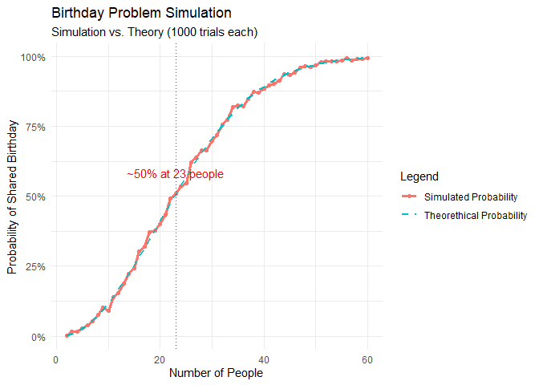

## Introduction

The **Birthday Problem** asks:

> In a group of $`n`$ people, what is the probability that at least two
> of them share the same birthday?

Surprisingly, this probability reaches **over 50%** with just 23 people
— far less than most people expect.  
Here, we’ll explore both the *theorethical* calculation and a
*simulation-based* approach.

## Parameters - Try Changing Them!

You can tweak these variables to see how the results change:

``` r
# Adjustable parameters
max_people <- 60  # Maximum group size to simulate
tries <- 1000     # Number of simulation trials per group size
verbose <- FALSE  # Set to TRUE to see simulation details
set.seed(42)      # Set seed for reproducibility
```

## Simulation approach

The idea:

1.  Randomly assign birthdays (1-365) to n people.

2.  Check if any birthday appears more than once.

3.  Repeat many times to estimate the probability.

``` r
results <- data.frame(
  people = integer(),
  probability = numeric()
)
```

``` r
# Function to simulate one group
simulate_group <- function(n_people) {
  birthdays <- sample(1:365, n_people, replace = TRUE)

  if (verbose) {
    cat(
      "Simulating group of", n_people, "people with birthdays:", birthdays, "\n"
    )
  }

  length(unique(birthdays)) < length(birthdays)
}
```

``` r
for (n_people in 2:max_people) {
  same_birthday <- sum(replicate(tries, simulate_group(n_people = n_people)))
  probability <- same_birthday / tries
  results <- rbind(
    results,
    data.frame(people = n_people, probability = probability)
  )

  cat(
    "For", n_people, "people, the simulated probability of shared birthday is",
    round(probability, 4), "\n"
  )
}
```

    ## For 2 people, the simulated probability of shared birthday is 0.003 
    ## For 3 people, the simulated probability of shared birthday is 0.015 
    ## For 4 people, the simulated probability of shared birthday is 0.017 
    ## For 5 people, the simulated probability of shared birthday is 0.029 
    ## For 6 people, the simulated probability of shared birthday is 0.04 
    ## For 7 people, the simulated probability of shared birthday is 0.052 
    ## For 8 people, the simulated probability of shared birthday is 0.077 
    ## For 9 people, the simulated probability of shared birthday is 0.101 
    ## For 10 people, the simulated probability of shared birthday is 0.091 
    ## For 11 people, the simulated probability of shared birthday is 0.139 
    ## For 12 people, the simulated probability of shared birthday is 0.155 
    ## For 13 people, the simulated probability of shared birthday is 0.189 
    ## For 14 people, the simulated probability of shared birthday is 0.223 
    ## For 15 people, the simulated probability of shared birthday is 0.242 
    ## For 16 people, the simulated probability of shared birthday is 0.302 
    ## For 17 people, the simulated probability of shared birthday is 0.321 
    ## For 18 people, the simulated probability of shared birthday is 0.371 
    ## For 19 people, the simulated probability of shared birthday is 0.378 
    ## For 20 people, the simulated probability of shared birthday is 0.399 
    ## For 21 people, the simulated probability of shared birthday is 0.435 
    ## For 22 people, the simulated probability of shared birthday is 0.493 
    ## For 23 people, the simulated probability of shared birthday is 0.509 
    ## For 24 people, the simulated probability of shared birthday is 0.535 
    ## For 25 people, the simulated probability of shared birthday is 0.546 
    ## For 26 people, the simulated probability of shared birthday is 0.622 
    ## For 27 people, the simulated probability of shared birthday is 0.637 
    ## For 28 people, the simulated probability of shared birthday is 0.663 
    ## For 29 people, the simulated probability of shared birthday is 0.663 
    ## For 30 people, the simulated probability of shared birthday is 0.697 
    ## For 31 people, the simulated probability of shared birthday is 0.719 
    ## For 32 people, the simulated probability of shared birthday is 0.755 
    ## For 33 people, the simulated probability of shared birthday is 0.772 
    ## For 34 people, the simulated probability of shared birthday is 0.818 
    ## For 35 people, the simulated probability of shared birthday is 0.823 
    ## For 36 people, the simulated probability of shared birthday is 0.822 
    ## For 37 people, the simulated probability of shared birthday is 0.847 
    ## For 38 people, the simulated probability of shared birthday is 0.872 
    ## For 39 people, the simulated probability of shared birthday is 0.871 
    ## For 40 people, the simulated probability of shared birthday is 0.885 
    ## For 41 people, the simulated probability of shared birthday is 0.897 
    ## For 42 people, the simulated probability of shared birthday is 0.903 
    ## For 43 people, the simulated probability of shared birthday is 0.912 
    ## For 44 people, the simulated probability of shared birthday is 0.936 
    ## For 45 people, the simulated probability of shared birthday is 0.933 
    ## For 46 people, the simulated probability of shared birthday is 0.943 
    ## For 47 people, the simulated probability of shared birthday is 0.959 
    ## For 48 people, the simulated probability of shared birthday is 0.966 
    ## For 49 people, the simulated probability of shared birthday is 0.961 
    ## For 50 people, the simulated probability of shared birthday is 0.967 
    ## For 51 people, the simulated probability of shared birthday is 0.978 
    ## For 52 people, the simulated probability of shared birthday is 0.982 
    ## For 53 people, the simulated probability of shared birthday is 0.982 
    ## For 54 people, the simulated probability of shared birthday is 0.981 
    ## For 55 people, the simulated probability of shared birthday is 0.985 
    ## For 56 people, the simulated probability of shared birthday is 0.993 
    ## For 57 people, the simulated probability of shared birthday is 0.986 
    ## For 58 people, the simulated probability of shared birthday is 0.991 
    ## For 59 people, the simulated probability of shared birthday is 0.991 
    ## For 60 people, the simulated probability of shared birthday is 0.993

## Theorethical approach

Mathematically, the probability that **no one** shares a birthday is:
``` math
P_{\text{no shared birthday}}(n) = \frac{365}{365} \times \frac{364}{365} \times \frac{363}{365} \times \ldots \times \frac{365 - n + 1}{365}
```
Thus, the probability that **at least two people share a birthday** is:
``` math
P_{\text{at least one shared birthday}}(n) = 1 - P_{\text{no shared birthday}}(n)
```

``` r
# Theorethical probability function
theorethical_probability <- function(n_people) {
  1 - prod((365:(365 - n_people + 1)) / 365)
}
```

``` r
results <- results %>%
  mutate(theorethical_probability = sapply(people, theorethical_probability))
```

## Comparing Simulation & Theory

``` r
ggplot(results, aes(x = people)) +
  geom_line(
    aes(y = probability, color = "Simulated Probability"),
    linewidth = 1.2
  ) +
  geom_point(aes(y = probability, color = "Simulated Probability")) +
  geom_line(
    aes(y = theorethical_probability, color = "Theorethical Probability"),
    linetype = "dashed",
    linewidth = 1
  ) +
  geom_vline(xintercept = 23, linetype = "dotted", color = "red") +
  annotate(
    "text",
    x = 23,
    y = 0.55,
    label = "~50% at 23 people",
    color = "red",
    vjust = -0.5
  ) +
  scale_y_continuous(labels = scales::percent) +
  labs(
    title = "Birthday Problem Simulation",
    subtitle = paste(
      "Simulation vs. Theory (", tries, " trials each)",
      sep = ""
    ),
    x = "Number of People",
    y = "Probability of Shared Birthday",
    color = "Legend"
  ) +
  theme_minimal()
```

<!-- -->

## Results & Insights

- Both methods agree closely, especially as the number of trials
  increases.
- The simulation adds randomness, so results may vary slightly each run.
- Even with **23 people**, the probability exceeds **50%**.
- By 60 people, the probability is above **99%**

## Conclusion

The Birthday Problem is a great example of counterintuitive probability.
Simulations like this help us verify theoretical results and build
intuition for probability concepts.
