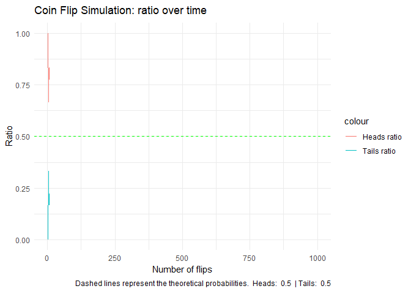

# Coin Flip Simulation

## Introduction

This project simulates repeated coin flips to explore the probabilities
of heads and tails. By running many trials, we can observe how the
outcomes converge to the expected probabilities of 50% heads and 50%
tails. This provides a concrete illustration of the **Law of Large
Numbers**.

## Parameters - Try changing them!

You can tweak these variables to see how the results change:

``` r
num_flips <- 1000   # Number of coin flips to simulate
verbose <- FALSE    # Set to TRUE to see simulation details
set.seed(42)        # Set seed for reproducibility

# Bias parameter: probability of heads
p_heads <- 0.5      # 0.5 = fair coin, try 0.7 for biased coin
```

## Simulation approach

We simulate `num_flips` coin tosses and track the running proportions of
heads and tails. According to the **Law of Large Numbers**, the observed
ratios should approach the true probabilities as the number of trials
grows.

``` r
results <- data.frame(
  flip = integer(),
  ratio_heads = numeric(),
  ratio_tails = numeric()
)
```

``` r
# Create enumeration for coin sides
coin <- list(heads = 0, tails = 1)

# Function to simulate coin flips
simulate_coin_flips <- function() {
  flip <- sample(
    c(coin$heads, coin$tails),
    size = 1,
    prob = c(p_heads, 1 - p_heads)
  )

  if (verbose) {
    cat("Got", ifelse(flip == coin$heads, "heads", "tails"), "\n")
  }

  flip
}
```

``` r
# Run the simulation and collect results
cat("Simulating ", num_flips, " coin flips...\n")
```

    ## Simulating  1000  coin flips...

``` r
for (i in 1:num_flips) {
  flip <- simulate_coin_flips()
  heads_ratio <- (sum(results$flip == coin$heads) + (flip == coin$heads)) / i
  tails_ratio <- (sum(results$flip == coin$tails) + (flip == coin$tails)) / i

  results <- rbind(
    results,
    data.frame(
      flip = flip,
      heads_ratio = heads_ratio,
      tails_ratio = tails_ratio
    )
  )
}

cat("Simulation complete!\n")
```

    ## Simulation complete!

## Theoretical approach

In theory, when flipping a fair coin, the probability of landing on
heads or tails is:

``` math
P(\text{heads}) = \frac{1}{2}, \quad P(\text{tails}) = \frac{1}{2}
```

This stems from the fact that a fair coin has two equally likely
outcomes, and the symmetry ensures no bias toward either side.

Another key property is **independence**: the result of one flip does
not influence the next. So, even if you flip ten heads in a row, the
probability of the next flip being tails is still 50%.

For $`n`$ independent flips, the **expected number** of tails is:

``` math
E[\text{tails}] = n \times \frac{1}{2}
```

Dividing by the total number of flips $`n`$, the expected proportion of
tails is always:

``` math
\frac{E[\text{tails}]}{n} = \frac{1}{2}
```

This explains why our plots include dashed reference lines at 0.5 (or at
$`p`$ and 1 - $`p`$ when biased). They represent the theoretical
probabilities predicted by the Law of Large Numbers.

``` r
theoretical_heads_line <- p_heads
theoretical_tails_line <- 1 - p_heads
```

## Comparing simulation and theory

Now let’s visualize the results of our simulation against the
theoretical probability.

``` r
# Plot the results
ggplot(results, aes(x = seq_len(nrow(results)))) +
  geom_line(aes(y = heads_ratio, color = "Heads ratio")) +
  geom_line(aes(y = tails_ratio, color = "Tails ratio")) +
  geom_hline(
    yintercept = theoretical_heads_line,
    linetype = "dashed",
    color = "red"
  ) +
  geom_hline(
    yintercept = theoretical_tails_line,
    linetype = "dashed",
    color = "green"
  ) +
  labs(
    title = "Coin Flip Simulation: ratio over time",
    x = "Number of flips",
    y = "Ratio",
    caption = paste(
      "Dashed lines represent the theoretical probabilities.",
      " Heads: ", round(theoretical_heads_line, 2),
      " | Tails: ", round(theoretical_tails_line, 2)
    )
  ) +
  theme_minimal() +
  ylim(0, 1) +
  transition_reveal(seq_len(nrow(results)))
```

<!-- -->

### Extension: Biased coin

If the coin is not fair, and the probability of heads is $`p`$ (with
$`0 < p < 1`$), then:

``` math
P(\text{heads}) = p, \quad P(\text{tails}) = 1 - p
```

Over many flips, the observed proportions converge to these values
rather than 0.5. Changing `p_heads` in the setup allows testing biased
coins directly.

## Results and insights

- Simulated proportions closely approach theoretical probabilities as
  the number of flips increases.
- This behavior illustrates the **Law of Large Numbers** in practice.

## Conclusion

This simulation provides a clear example of probability in action. By
running many coin flips, the empirical results align with theoretical
expectations, reinforcing how randomness averages out in large samples.
