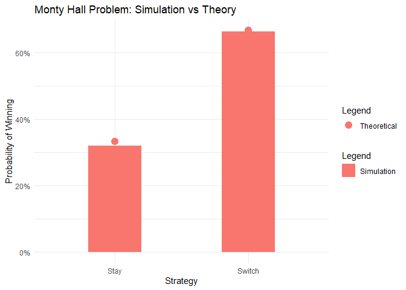

# The Monty Hall Problem Simulation

## Introduction

The **Monty Hall problem** is a famouts probability puzzle based on a
game show scenario. In the game:

1.  There are **three doors**: behind one is a **car** (the prize),
    bethind the other two are **goats**.
2.  The contestant picks one door.
3.  The host, knowing what’s behind each door, opens a different door
    with a goat.
4.  You are offered the chance to **stay** with your original door or
    **switch** to the other unopened door.

## Question

**Is it better to stay with your original choice or switch to the other
door?**

## Paramaters - Try changing them!

You can tweak these variables to see how the results change:

``` r
tries <- 1000     # Number of simulation trials
verbose <- FALSE  # Set to TRUE to see simulation details
set.seed(42)      # Set seed for reproducibility
```

## Simulation Approach

The idea:

1.  Simulate the game many times.
2.  Count how many times the contestant wins by staying with their
    original choice.
3.  Count how many times the contestant wins by switching to the other
    door.

``` r
simulate_monty <- function(
  strategy = c("stay", "switch"),
  tries = 1000,
  verbose = TRUE
) {
  strategy <- match.arg(strategy)
  wins <- 0

  for (i in 1:tries) { # 1.
    prize <- sample(1:3, 1) # Randomly place the car behind one of the doors
    choice <- sample(1:3, 1) # Contestant makes an initial choice

    open_door <- setdiff(1:3, c(prize, choice))[1] # Host opens a goat door

    if (strategy == "switch") {
      # Switch to the other unopened door
      choice <- setdiff(1:3, c(choice, open_door))
    }

    if (choice == prize) wins <- wins + 1

    if (verbose) {
      cat("Trial ", i, " - Prize: ", prize,
          "Choice: ", choice, "Open Door: ", open_door,
          " - Win: ", ifelse(choice == prize, "Yes", "No"), "\n")
    }
  }

  wins / tries # Return the win probability
}

results <- data.frame(
  Strategy = c("Stay", "Switch"),
  Probability = c(
    simulate_monty("stay", tries = tries, verbose = verbose), # 2.
    simulate_monty("switch", tries = tries, verbose = verbose) # 3.
  )
)
```

## Results table

``` r
results
```

    ##   Strategy Probability
    ## 1     Stay       0.319
    ## 2   Switch       0.663

## Theoritical approach

We can reason this mathematically:

- Probability of winning **by staying**:
  ``` math
   P_{\text{stay}} = \frac{1}{3} 
  ```
- Probability of winning **by switching**:
  ``` math
   P_{\text{switch}} = \frac{2}{3} 
  ```

> Why $`P_{\text{stay}} = \frac{1}{3}`$ and
> $`P_{\text{switch}} = \frac{2}{3}`$ ?

- When you first pick a door, there’s a **1/3** chance the car is behind
  *your* choosen door and a **2/3** chance it is behind *one of the
  other two doors*.
- The host then opens a door that **always** reveals a goat (he never
  opens the car).
- If your initial pick was the car (**1/3** chance), switching loses. If
  your initial pick was a goat (**2/3** chance), the host’s forced
  reveal leaves the car behind the *only remaining* closed door, so
  switching wins.
- Therefore: staying wins with a probability of **1/3** and switching
  wins with a probability of **2/3**.

``` r
theorethical <- data.frame(
  Strategy = c("Stay", "Switch"),
  Probability = c(1 / 3, 2 / 3)
)
```

## Plot: Simulation vs Theory

``` r
ggplot() +
  geom_col(
    data = results, aes(x = Strategy, y = Probability, fill = "Simulation"),
    position = position_dodge(width = 0.8),
    width = 0.4
  ) +
  geom_point(
    data = theorethical, aes(
                             x = Strategy,
                             y = Probability,
                             color = "Theoretical"),
    size = 4
  ) +
  scale_y_continuous(labels = scales::percent) +
  labs(
    title = "Monty Hall Problem: Simulation vs Theory",
    x = "Strategy",
    y = "Probability of Winning",
    fill = "Legend",
    color = "Legend"
  ) +
  theme_minimal()
```

<!-- -->

## Conclusion

Our simulation confirms the **counterintuitive truth**: - Staying wins
~33% of the time. - Switching wins ~66% of the time.

The Monty Hall problem is a classic illustration of **conditional
probability** and a good reminder to **always switch doors** when given
the choice.
